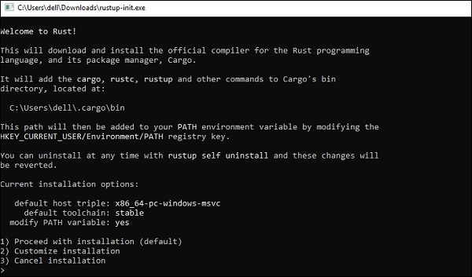
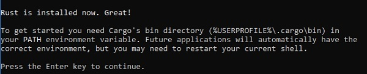

# Rust 开发环境配置

Rust 语言的环境配置还是相对简单的，因为官方提供了 rustup 这个一步配置工具。rustup 是 Rust 官方推出的基于 终端/控制台/shell 的工具，可用于管理 Rust 版本和相关工具

### Windows 上安装 Rust

Windows 上安装任何语言的开发环境都有一点复杂，Rust 也无法避免这一点：

1. Windows 上运行 Rust 编译器需要 C++ 开发环境。

我们推荐的做法是安装 Visual Studio 2013 或更高的版本。你可以点击 [VS 2013 Express](https://download.microsoft.com/download/2/5/5/255DCCB6-F364-4ED8-9758-EF0734CA86B8/vs2013.3_dskexp_ENU.iso) 链接下载 Visual Studio 2013 并安装，详细的安装流程请参考 [Visual Studio 2013](https://support.microsoft.com/zh-cn/help/2899270/visual-studio-2013-setup-common-issues-and-workarounds)。

2. 点击 [Rust 安装工具](https://www.rust-lang.org/tools/install) 下载 Windows 版本的 rustup-init.exe 工具。

3. 双击下载好的 rustup-init.exe 文件，然后你就会看到如下的界面。



4. 从上面的界面中我们可以看到三个安装选项，一般情况下我们选择默认，也就是1。 选择默认什么都不要做，直接按下 回车键 就好。按下回车键后，Rust 就会开始安装，一般情况下，只要静静地等待安装完成即可。

5. 安装完成后会出现如下界面。



6. 从安装成功后的提示来看，Rust 被安装到目录 C:\Users\{PC}\.cargo\bin 里打开你自己的 C:\Users\{PC}\.cargo\bin 目录，可以看到下面的文件列表
```
cargo-fmt.exe
cargo.exe
rls.exe
rust-gdb.exe
rust-lldb.exe
rustc.exe // this is the compiler for rust
rustdoc.exe
rustfmt.exe
rustup.exe
```

我们简单的对上面的文件做个介绍

- Cargo 是 Rust 的包管理器。类似于 Nodejs 中的 npm 或 Python 中的 pip 或者 PHP 中的 composer。 我们可以通过运行下面的命令来检查 Cargo 是否安装正确和已经安装的版本。
```
C:\Users\Admin>cargo -V
cargo 1.29.0 (524a578d7 2018-08-05)
```

- rustc 是 Rust 的编译器，类似于 Java 中的 Javac 或 C/C++ 中的 gcc。 我们可以通过下面的命令来检查 rustc 是否安装正确和已经安装的版本。
```
C:\Users\Admin>cargo -V
cargo 1.29.0 (524a578d7 2018-08-05)
```

### Linux 或 Mac 上安装

Linux 或 Mac 上安装 Rust 和 rustup 真的是再简单不过了，只要打开 终端 / Shell 输入下面的命令然后按下回车键

```
curl https://sh.rustup.rs -sSf | sh
```

上面那段脚本命令```curl https://sh.rustup.rs -sSf | sh```会下载必须的脚本并开始安装 rustup 工具，同时会安装当前最新的稳定版的的 Rust。

因为安装可能需要管理权限，因此可能会询问你的登陆密码。

安装完成后 终端 / shell 中会出现一下文字
```
Rust is installed now. Great!
```

上面这个安装命令会自动将 rustc 和 cargo 等命令添加到 PATH 路径中，我们只要重启终端/shell 就能立即使用。

如果你不想重启终端，那么你只需要运行下面的 shell 命令重新加载 环境变量 即可
```
source $HOME/.cargo/env
```
或者，你可以运行下面的命令手动将 rust 的安装目录临时添加到 PATH 中
```
export PATH="$HOME/.cargo/bin:$PATH"
```
> 注意
因为安装过程中可能出现各种错误。如果你尝试编译 Rust 程序却输出链接器无法执行的错误时，意味着你的系统上未安装链接器，这个需要我们手动安装。